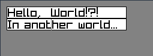

# Widgets

Custom widgets written in Odin for raylib.

## Available Widgets

* TextField - You can have more than one on screen!
* Button - A clickable button!

## TODO

* [ ] Figure out other widgets to make
* [x] TextField
  * [x] Keyboard inputs
  * [x] Mouse position selection
  * [x] Text selection
  * [x] Copy and paste
  * [ ] Textured boarders and background
  * [ ] Alignment to a point: left, right, top, bottom
  * [ ] Width auto adjust: text longer than field, window shrinking/expanding, max width
* [x] Button
  * [x] Mouse hover and pressed
  * [ ] Textured boarders and background
  * [ ] Alignment to a point: left, right, top, bottom
  * [ ] Width auto adjust: text longer than field, window shrinking/expanding, max width

## Example

[See the example in the main.odin file](main.odin)
